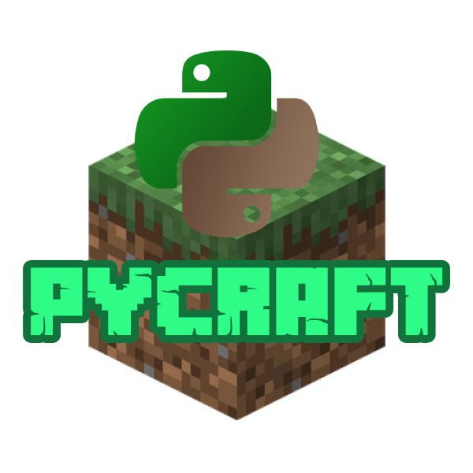
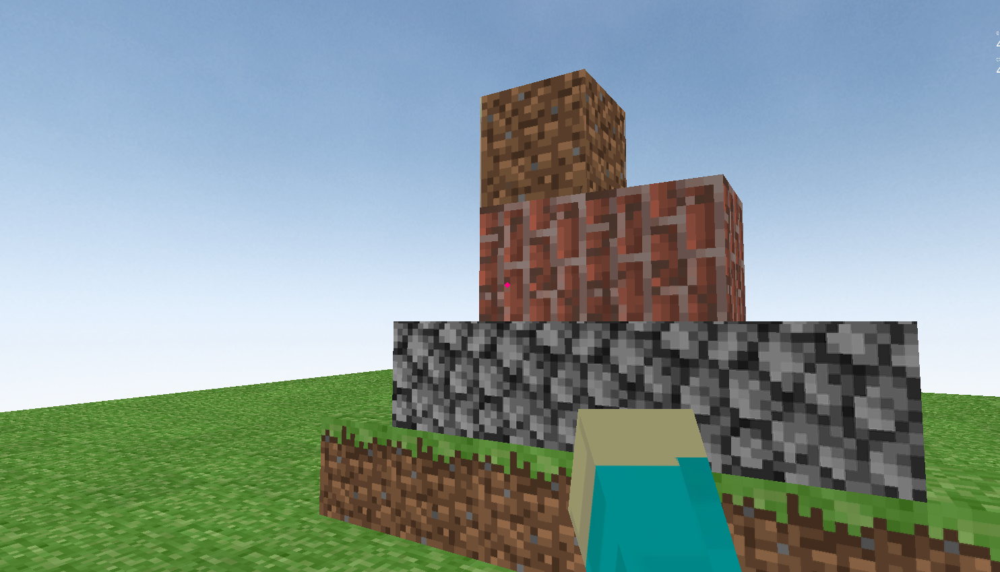

# Pycraft with Ursina 🏗️🎮


This project implements **Pycraft**, a simple **Minecraft-like game** using **Python** and the **Ursina** engine. The game features a first-person controller, a basic voxel-based world, and interactive elements for block placement and destruction.

## Project Overview 🎯

**Pycraft** is a basic implementation of a voxel-based world, similar to Minecraft. Players can navigate the world, place blocks, and destroy them. The game provides an interactive experience with different block types and a hand animation for interactions.

## Project Components ⚙️

1. **Game Logic (`main.py`)**: Contains the primary game logic, including handling user input, managing the voxel world, and rendering the blocks and player interactions.

2. **Voxel Class**:
   - **Voxel**: Represents individual blocks in the world. Handles block placement, destruction, and updates based on player interactions.

3. **Sky Class**:
   - **Sky**: Represents the skybox in the game, providing a spherical background to the scene.

4. **Hand Class**:
   - **Hand**: Represents the player’s hand, which changes position based on player interactions.

5. **Player Controller**:
   - **FirstPersonController**: Allows the player to move around the world in a first-person view.

## Features 🌟

- **Voxel Placement and Destruction**: 
  - Use the left mouse button to place blocks and the right mouse button to destroy them.
  - Cycle through different block types with the number keys (1-4).

- **Interactive Hand Animation**: 
  - The hand position adjusts based on whether the player is interacting with the world.

- **Customizable World**: 
  - The game generates a grid of blocks to create the world.

## Usage 🧑‍💻

1. **Download and Install Dependencies**:
    - You need to install **Ursina**. You can do this using pip:
      ```bash
      pip install ursina
      ```

2. **Run the Game**:
    - Simply execute the script to start the game:
      ```bash
      python main.py
      ```

3. **Interact with the Game**:
    - **Left Mouse Click**: Place a block.
    - **Right Mouse Click**: Destroy a block.
    - **Number Keys (1-4)**: Select the block type for placement.

4. **Game Objective**:
    - Explore the voxel world, place and destroy blocks, and enjoy the simple first-person navigation.

## Dependencies 📦

- **Ursina**: A game engine for creating 3D games in Python.
- **Python**: Ensure you have Python installed to run the script.

## Installation and Running the Game 🛠️

1. **Clone the Repository**:
    ```bash
    git clone https://github.com/your-username/pycraft.git
    cd pycraft
    ```

2. **Install Ursina**:
    ```bash
    pip install ursina
    ```

3. **Run the Game**:
    ```bash
    python main.py
    ```

## Screenshots 📸



## Contributing 🫂

Contributions to enhance the game or add new features are welcome! Feel free to open issues or submit pull requests.

## Acknowledgements ⭐

- Special thanks to the creators of **Ursina** for providing an easy-to-use engine for Python game development.
- Thanks to the **Minecraft** community for inspiration and the voxel-based game concept.
